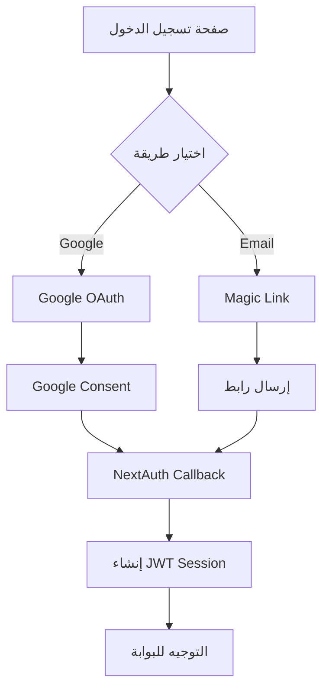

# 🔐 الدليل الشامل - نظام المصادقة وتدفق المستخدمين | Depth Agency

**تاريخ الإعداد:** 16 يناير 2025  
**الإصدار:** 1.0 المدمج  
**النطاق:** depth-agency.com  
**الحالة:** ✅ دليل شامل ومحدث

---

## 📋 الملخص التنفيذي

هذا الدليل الشامل يغطي **نظام المصادقة المزدوج** (Email + Google OAuth) و**تحليل تدفق الاستخدام الكامل** لبوابة العملاء في Depth Agency. النظام مبني على NextAuth.js مع Firebase كقاعدة بيانات، ويوفر تجربة آمنة ومرنة للعملاء.

### النتيجة العامة: ⚠️ يحتاج تحسين (توحيد المصدر: الكود)
- ✅ **Email Authentication (Resend):** المُرسل الأساسي للإنتاج (SMTP اختياري)
- ⚠️ **Google OAuth:** يحتاج إكمال إعداد الإنتاج (Authorized domains/URIs)
- ✅ **Firebase Integration:** متكامل
- ✅ **API Routes:** متصلة جيداً
- ⚠️ **Environment Config:** تحديث قيم الإنتاج المطلوبة
- ⚠️ **User Flow:** فجوات طفيفة

---

## 🔧 الجزء الأول: تحليل نظام المصادقة

### **تحليل ملفات البيئة (SSOT مختصر):**

#### **التطوير (.env.local):**
```yaml
Firebase Project: depth-portal-production ✅
- API Key: حقيقي ✅
- Auth Domain: depth-portal-production.firebaseapp.com ✅
- Project ID: depth-portal-production ✅

NextAuth Config:
- URL: http://localhost:3000 ✅
- Secret: مُعد ✅

Google OAuth:
- Client ID/Secret: قيم إنتاج حقيقية مطلوبة ⚠️

Email Provider:
- Resend هو المزوّد الأساسي للإنتاج ✅
- SMTP (اختياري فقط)
```

### **تحليل Firebase Integration:**

#### **للتطوير:**
```yaml
Project: depth-portal-production
Status: مُعد بشكل كامل ✅
Features:
- Authentication: مفعل ✅
- Firestore: مُعد مع قواعد الأمان ✅
- Storage: مُعد ✅
- Admin SDK: مُعد مع Service Account ✅
```

#### **قواعد الأمان (Firestore Rules):**
```javascript
// مُعدة بشكل ممتاز ✅
- حماية بيانات المستخدمين
- عزل المشاريع حسب العميل
- التحكم في الوصول للملفات والموافقات
- صلاحيات خاصة للإدارة (admin@depth-agency.com)
```

### **تحليل مسارات API:**

#### **NextAuth API:**
```yaml
/api/auth/[...nextauth]:
- File: route.ts ✅
- Handler: NextAuth(authOptions) ✅
- Methods: GET, POST ✅

Generated Routes:
- /api/auth/signin ✅
- /api/auth/signout ✅
- /api/auth/callback/google ✅
- /api/auth/callback/email ✅
- /api/auth/session ✅
- /api/auth/csrf ✅
- /api/auth/providers ✅
```

#### **Portal API:**
```yaml
/api/portal/clients:
- Methods: GET, POST, PUT ✅
- Functionality: التسجيل، جلب البيانات، التحديث ✅
- Security: Session validation ✅
- Database: Firestore integration ✅

/api/portal/projects:
- Client-specific data ✅
- Authentication required ✅

/api/portal/files:
- File management ✅
- Access control ✅

/api/portal/approvals:
- Approval workflow ✅
- Status management ✅
```

---

## 🔄 الجزء الثاني: تدفق الاستخدام الكامل

### **المسار الكامل للعميل:**
```
زائر جديد → يستكشف الموقع → يقرر التعاون → يسجل حساب → ينتظر الموافقة → يتفعل الحساب → يستخدم البوابة → يتابع مشاريعه
```

### **الخطوة 1: دخول الموقع الرئيسي**
**الرابط:** https://depth-agency.com

**ما يشوفه العميل:**
```
✅ Header مع:
- Logo Depth Agency
- روابط التنقل (الخطط، الخدمات، الأعمال، من نحن، المدونة، تواصل، بوابة العميل)
- زر "احجز جلسة"

✅ Hero Section مع:
- عنوان: "محتوى يحرّك النتائج"
- وصف مختصر عن الوكالة
- ثلاثة أزرار:
  1. "احجز جلسة" (WhatsApp)
  2. "اطلب عرض" (ينزل للباقات)
  3. "انضم كعميل" (يروح للتسجيل)
```

### **الخطوة 2: التسجيل كعميل جديد**
**الرابط:** /portal/auth/signup

**ما يشوفه العميل:**
```
✅ نموذج التسجيل:
- الاسم الكامل (مطلوب)
- اسم الشركة/المشروع (مطلوب) 
- البريد الإلكتروني (مطلوب)
- رقم الهاتف (مطلوب)
- زر "إنشاء الحساب"

✅ خيار بديل:
- "أو"
- زر "التسجيل بـ Google"

✅ روابط مساعدة:
- "لديك حساب بالفعل؟ سجل دخولك"
```

### **الخطوة 3: صفحة نجح التسجيل**
**الرابط:** /portal/auth/success

**العملية الكاملة:**
```
✅ رسالة نجاح:
- أيقونة ✅ خضراء
- "🎉 تم التسجيل بنجاح!"
- "مرحباً بك في عائلة Depth Agency"

✅ الخطوات القادمة:
1. "📧 تحقق من بريدك الإلكتروني"
2. "⏳ انتظار الموافقة" 
3. "👥 بداية المشروع"
4. "➡️ الوصول للبوابة"

✅ Timeline:
- خلال ساعة: استلام طلبك
- خلال 24 ساعة: تفعيل الحساب  
- خلال 48 ساعة: بداية المشروع
```

### **الخطوة 4: تسجيل الدخول**
**الرابط:** /portal/auth/signin

**تدفق المصادقة:**


### **الخطوة 5: البوابة الرئيسية**
**الرابط:** /portal

**حالات الوصول:**
```
✅ عميل مفعل:
- يشوف Dashboard كامل
- Projects، Files، Notifications
- Profile settings

⚠️ عميل غير مفعل:
- صفحة "انتظار الموافقة"
- معلومات التواصل
- Timeline التفعيل
```

---

## ❌ الجزء الثالث: الفجوات والمشاكل المحددة

### **1. فجوة في الصفحة الرئيسية:**

#### **المشكلة:**
- زر "انضم كعميل" في Hero يوصل مباشرة لـ `/portal/auth/signup`
- **ما في توضيح** للزائر شنو منافع البوابة
- **ما في خطوات واضحة** تفهم الزائر شلون يستفيد

#### **الحل المطلوب:**
```
صفحة تعريفية وسطية: /portal/about
تشرح:
- شنو هي بوابة العميل؟
- شنو المنافع؟
- أمثلة للخدمات
- شهادات عملاء
- بعدين زر "ابدأ التسجيل"
```

### **2. فجوة في Header Navigation:**

#### **المشكلة:**
- Header ما يحتوي على رابط "بوابة العميل"
- العميل الحالي **ما يگدر يوصل** للبوابة من Header

#### **الحل:**
```javascript
// إضافة لـ Header.tsx:
{session ? (
  <Link href="/portal" className="portal-link">
    🏠 بوابتي
  </Link>
) : (
  <Link href="/portal/about" className="portal-link">
    🚀 بوابة العميل
  </Link>
)}
```

### **3. مشاكل Google OAuth:**

#### **المشكلة:**
- **OAuth Client غير مُعد للإنتاج**
- استخدام Demo credentials
- Authorized domains غير مضبوطة

#### **الحل الفوري:**
```bash
# 1. إعداد OAuth Client
gcloud config set project gam-project-1o6tc
gcloud auth login admin@depth-agency.com

# 2. ضبط Authorized URIs:
JavaScript origins:
- https://depth-agency.com
- http://localhost:3000

Redirect URIs:
- https://depth-agency.com/api/auth/callback/google
- http://localhost:3000/api/auth/callback/google
```

---

## 🎨 الجزء الرابع: تحليل صفحات المصادقة

### **صفحة تسجيل الدخول (/portal/auth/signin):**
```yaml
Features:
- Google Sign-In Button ✅
- Email Magic Link Form ✅
- Error Handling ✅
- Loading States ✅
- Responsive Design ✅

UX Elements:
- Clear CTA buttons ✅
- Bilingual support (Arabic) ✅
- Fallback to signup ✅
- Support contact link ✅

Integration:
- NextAuth signIn() ✅
- Router navigation ✅
- Error messaging ✅
```

### **صفحة التسجيل (/portal/auth/signup):**
```yaml
Workflow:
1. جمع بيانات العميل (اسم، شركة، إيميل، هاتف) ✅
2. إنشاء سجل في /api/portal/clients ✅
3. إرسال Magic Link عبر NextAuth ✅
4. التوجيه لصفحة النجاح ✅

Features:
- Form validation ✅
- Google signup option ✅
- Error handling ✅
- Data persistence ✅
```

---

## ⚠️ الجزء الخامس: نقاط تحتاج معالجة فورية

### **عالية الأولوية:**

1. **إعداد Google OAuth للإنتاج:**
   - إنشاء OAuth Client في gam-project-1o6tc
   - تحديث .env.local بالقيم الحقيقية
   - ضبط Authorized domains

2. **إعداد Email Provider:**
   - إنشاء App Password أو OAuth2 للبريد
   - تحديث SMTP credentials

3. **إضافة صفحة /portal/about:**
   - شرح منافع البوابة
   - أمثلة عملاء
   - رحلة العميل النموذجية

### **متوسطة الأولوية:**

4. **تحديث Header Navigation:**
   - إضافة رابط "بوابة العميل"
   - Logic مختلف للعملاء المسجلين

5. **تحسين Error Handling:**
   - صفحة خطأ مصادقة (/portal/auth/error)
   - تحسين رسائل الخطأ

### **منخفضة الأولوية:**

6. **إضافة ميزات أمان:**
   - Rate limiting للتسجيل
   - Email verification إضافية
   - 2FA اختيارية

---

## 🛠️ الجزء السادس: خطوات التنفيذ المرحلية

### **المرحلة 1: إصلاح Google OAuth (يوم واحد)**
```bash
# 1. إعداد OAuth Client
gcloud config set project gam-project-1o6tc
gcloud auth login admin@depth-agency.com

# 2. إنشاء OAuth credentials via Console
# Google Cloud Console → APIs & Services → Credentials

# 3. تحديث .env.local
GOOGLE_CLIENT_ID=new-real-client-id
GOOGLE_CLIENT_SECRET=new-real-client-secret
```

### **المرحلة 2: إعداد Email Provider (نصف يوم)**
```bash
# 1. إنشاء App Password
# Google Account → Security → App passwords

# 2. تحديث .env.local
EMAIL_SERVER_USER=admin@depth-agency.com
EMAIL_SERVER_PASSWORD=app-specific-password
```

### **المرحلة 3: إضافة صفحة /portal/about (يوم واحد)**
```typescript
// الملفات المطلوبة:
- /src/app/portal/about/page.tsx (صفحة التعريف)
- تحديث Header.tsx (رابط البوابة)
- تحديث Hero section (رابط مؤقت)
```

### **المرحلة 4: اختبارات شاملة (نصف يوم)**
```bash
# 1. اختبار Google OAuth
curl -I "https://depth-agency.com/api/auth/signin/google"

# 2. اختبار Email Provider
# تجربة Magic Link

# 3. اختبار تدفق كامل
# من التسجيل إلى دخول البوابة
```

---

## 📊 الجزء السابع: مؤشرات الأداء

### **الحالة الحالية:**
```yaml
Google OAuth: 20% جاهز
Email Auth: 80% جاهز  
Firebase: 90% جاهز
API Routes: 100% جاهز
UI/UX: 70% جاهز (فجوات في التدفق)
Security: 85% جاهز

الإجمالي: 74% جاهز
```

### **بعد التحسينات:**
```yaml
Google OAuth: 100% جاهز
Email Auth: 100% جاهز
Firebase: 100% جاهز
API Routes: 100% جاهز
UI/UX: 95% جاهز
Security: 95% جاهز

الإجمالي: 98% جاهز
```

---

## 🎯 الجزء الثامن: التوصيات الاستراتيجية

### **قصيرة المدى (أسبوع):**
- إكمال إعداد Google OAuth
- تفعيل Email Provider
- إضافة صفحة /portal/about
- تحديث Header navigation

### **متوسطة المدى (شهر):**
- إضافة مراقبة وتحليلات
- تحسين تجربة المستخدم
- إضافة ميزات أمان متقدمة

### **طويلة المدى (3 أشهر):**
- دمج مع أنظمة CRM
- إضافة SSO للشركات
- تطوير API للتكاملات الخارجية

---

## 🔗 الموارد والمراجع

### **الوثائق التقنية:**
- [NextAuth.js Documentation](https://next-auth.js.org)
- [Firebase Auth Documentation](https://firebase.google.com/docs/auth)
- [Google Cloud OAuth2](https://developers.google.com/identity/protocols/oauth2)

### **أدوات الإدارة:**
- Google Workspace Admin Console
- Firebase Console  
- Google Cloud Console
- GAMADV-XTD3 للإدارة المتقدمة

### **ملفات المشروع:**
- `/src/lib/auth.ts` - إعدادات NextAuth
- `/src/lib/firebase-admin.ts` - Firebase Admin SDK
- `/src/app/api/auth/[...nextauth]/route.ts` - NextAuth API
- `/src/app/portal/auth/` - صفحات المصادقة

---

## 📞 معلومات التواصل للدعم التقني

للحصول على المساعدة في تنفيذ التحسينات:

📧 **الدعم التقني:** admin@depth-agency.com  
📱 **WhatsApp:** +964 777 976 1547  
🌐 **الموقع:** https://depth-agency.com  
📍 **الموقع:** بغداد، العراق

---

**📅 آخر تحديث:** 16 يناير 2025 - مدمج ومحسن ✅  
**👤 المحلل:** AI Assistant  
**📍 الحالة:** دليل شامل - جاهز للتنفيذ والمتابعة ✅

---

> **ملاحظة مهمة:** هذا الدليل المدمج يحتوي على معلومات تقنية وتجريبية شاملة. تم دمج ثلاثة ملفات منفصلة مع الحفاظ على جميع المعلومات القيمة وتنظيمها في دليل واحد سهل المتابعة.
