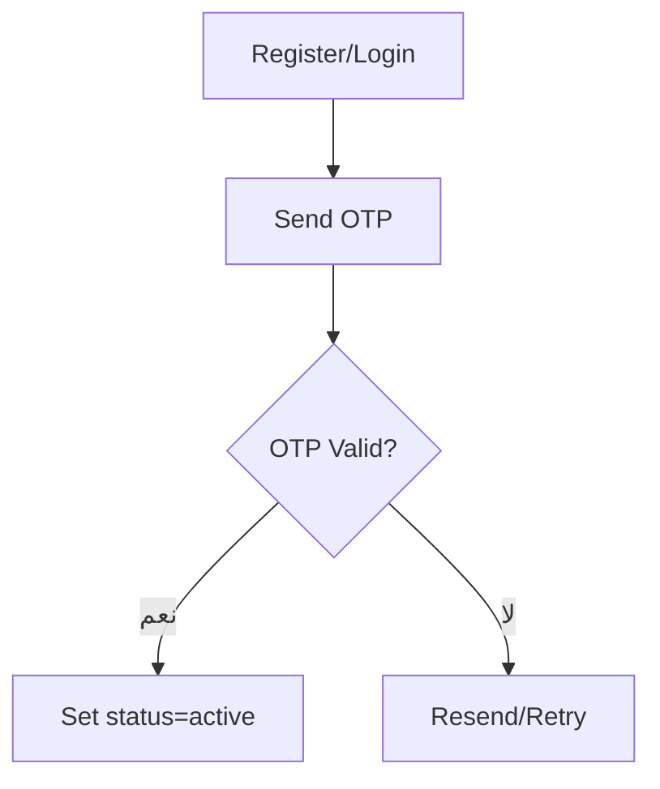
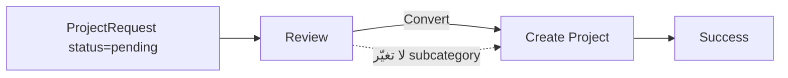
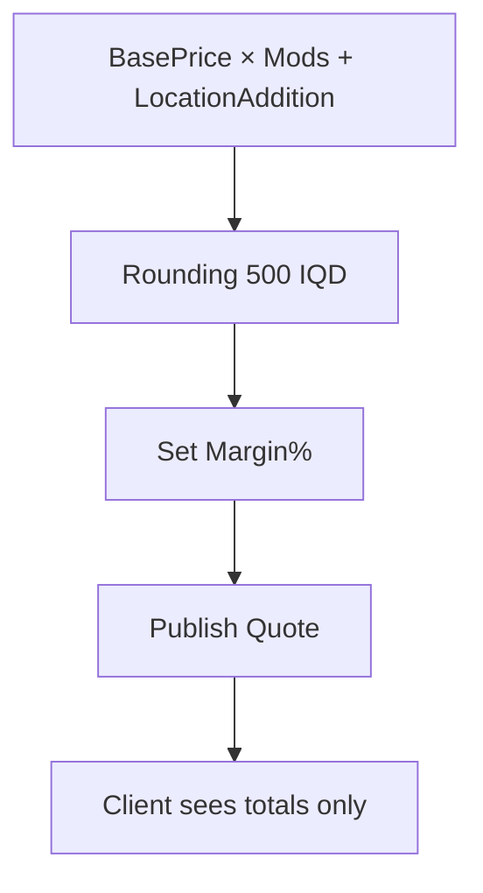

# ♻️ UX Flows – Depth V2.0

## الفهرس
- [فلو: إنشاء حساب/OTP (كل الأدوار)](#flow-auth-otp)
- [فلو: إنشاء طلب (Client)](#flow-client-request)
- [فلو: تحويل طلب إلى مشروع (Admin)](#flow-admin-convert)
- [فلو: تعيين مبدع/إعادة ترشيح (Admin)](#flow-admin-assign)
- [فلو: إعداد عرض السعر (Admin→Client)](#flow-admin-quote)
- [فلو: تنفيذ المشروع وتسليم (Creator→Client)](#flow-creator-deliver)
- [فلو: مهام الموظف (SalariedEmployee)](#flow-salaried-tasks)
- [فلو: إعدادات الإشعارات + fallback](#flow-notifications-fallback)

<a id="flow-auth-otp"></a>
## فلو: إنشاء حساب/OTP (كل الأدوار)
- الخطوات (1→2→3): إدخال هاتف/إيميل → استلام OTP → تحقق وتفعيل الدور.
- الحالات: pending → active، فشل OTP يعاد الإرسال.
- شنو يطلع: حقل OTP، عدّاد مؤقت، زر إعادة إرسال.
- مراجع: OTP — `documentation/00-overview/00-introduction.md:110,635`; مجموعة `otpCodes` — `documentation/02-database/01-database-schema.md:478`.



<a id="flow-client-request"></a>
## فلو: إنشاء طلب (Client)
- الخطوات (1→2→3): Category/Subcategory إلزامي → ProcessingLevel + Rush (افتراضي Off) → مرفقات → إرسال.
- تفريعات: Rush on/off.
- شنو يطلع: بانر “تم الاستلام — status=pending. عند مراجعة الأدمن تصير reviewing”.
- مراجع: `status: 'pending'|'reviewing'` — `documentation/02-database/01-database-schema.md:306`; lineItems/processingLevel — `documentation/02-database/01-database-schema.md:244–247`.

```text
+--------------------------------------------------------------+
| طلب جديد                                                     |
| Step 1: [Category v][Subcategory v*]                         |
| Step 2: [ProcessingLevel v]  Rush: [ Off ] (toggle)          |
|         [Description (optional ≤1000)]                       |
| Step 3: Attachments [ + Add files ]  [ Upload ]              |
|                                     [إرسال الطلب]           |
| Banner: تم الاستلام — status=pending → reviewing             |
+--------------------------------------------------------------+
```

<a id="flow-admin-convert"></a>
## فلو: تحويل طلب إلى مشروع (Admin)
- الخطوات: فتح طلب pending → مراجعة → تحويل إلى مشروع بدون تغيير subcategory → إنشاء lineItems.
- تفريعات: تعدد lineItems.
- شنو يطلع: رسالة “تم إنشاء المشروع”.
- مراجع: subcategory لا يتغير — `documentation/02-database/01-database-schema.md:241`; lineItems — `documentation/02-database/01-database-schema.md:244–259`.



<a id="flow-admin-assign"></a>
## فلو: تعيين مبدع/إعادة ترشيح (Admin)
- الخطوات: فلترة subcategoryId + processingLevel + isAvailable → ترتيب rating ↓ → تعيين/إعادة ترشيح.
- تفريعات: رفض/قبول.
- شنو يطلع: توست “تم التعيين/رفض — إعادة ترشيح…”.
- مراجع: الفهارس والفلترة — `documentation/02-database/02-indexes-and-queries.md:74–84,94`, `documentation/02-database/01-database-schema.md:512–519`.

```text
Filter: [subcategoryId] [processingLevel] [isAvailable]
Sort: rating desc
List:
  (● avail) Ali — 4.8 ★
  (○ busy) Sara — 4.6 ★
[Assign]  [Re-nominate]
```

<a id="flow-admin-quote"></a>
## فلو: إعداد عرض السعر (Admin→Client)
- الخطوات: حساب التكلفة = BasePrice × معاملات (Ownership/Processing/Experience/Equipment/Rush) + LocationAddition → تقريب لأقرب 500 IQD → تعيين الهامش → نشر Quote.
- عرض العميل: الإجماليات فقط (بدون CreatorPrice/Margin/اسم المبدع).
- مراجع: المعاملات/الأسعار — `documentation/02-database/01-database-schema.md:261–268,273`; مثال الحساب — `documentation/02-database/01-database-schema.md:636–638`.



<a id="flow-creator-deliver"></a>
## فلو: تنفيذ المشروع وتسليم (Creator→Client)
- الخطوات: رفع مسودّات (Draft) → Ready for Review → رفع نهائي.
- شنو يطلع: إشعارات In-App/Email للعميل.
- مراجع: سياسة الرفع 2GB + chunked + denylist + MIME + virus scan — `documentation/03-api/features/05-storage.md:88`; القنوات — `documentation/02-database/01-database-schema.md:426`.

```text
Project Files
  [ Upload Draft ]  (2GB, chunked)
  Scan: virus OK | MIME OK | denylist OK
  [ Mark Ready for Review ] → Notify Client (In-App/Email)
  [ Upload Final ]
```

<a id="flow-salaried-tasks"></a>
## فلو: مهام الموظف (SalariedEmployee)
- الخطوات: يشوف مهامه → يرفع ملفات → يحدّث حالة المهمة.
- سياسة: ما يشوف أسعار نهائياً.
- مراجع: assignments (type) — `documentation/02-database/01-database-schema.md:250–259`.

```mermaid
flowchart LR
  T[My Tasks] --> U[Upload Files]
  U --> S[Set Status]
  S --> Done[Completed]
  note right of T: لا أسعار
```

<a id="flow-notifications-fallback"></a>
## فلو: إعدادات الإشعارات + fallback
- القنوات: In-App/Email/SMS — `documentation/02-database/01-database-schema.md:426`, نظرة عامة — `documentation/00-overview/00-introduction.md:370`.
- fallback: فشل SMS → Email تلقائي، تسجيل في notifications — `documentation/02-database/02-indexes-and-queries.md:23–24,62`.

```text
Preference: [In-App] [Email] [SMS]
Send → if SMS fail → auto Email → channelFallback="sms→email"
```
