# ♻️ UX Flows – Depth V2.0

## الفهرس
- [فلو: إنشاء حساب/OTP (كل الأدوار)](#flow-auth-otp)
- [فلو: إنشاء طلب (Client)](#flow-client-request)
- [فلو: تحويل طلب إلى مشروع متعدد المهام (Admin)](#flow-admin-convert)
- [فلو: نظام التوصيات الذكية (Admin)](#flow-smart-recommendations)
- [فلو: إدارة المهام Tasks (Admin/Creator)](#flow-tasks-management)
- [فلو: تعيين مبدع/إعادة ترشيح (Admin)](#flow-admin-assign)
- [فلو: إعداد عرض السعر (Admin→Client)](#flow-admin-quote)
- [فلو: تنفيذ المشروع وتسليم (Creator→Client)](#flow-creator-deliver)
- [فلو: مهام الموظف (SalariedEmployee)](#flow-salaried-tasks)
- [فلو: القوالب الموحدة UPT (All Roles)](#flow-unified-templates)
- [فلو: إعدادات الإشعارات + fallback](#flow-notifications-fallback)

<a id="flow-auth-otp"></a>
## فلو: إنشاء حساب/OTP (كل الأدوار)
- الخطوات (1→2→3): إدخال هاتف/إيميل → استلام OTP → تحقق وتفعيل الدور.
- الحالات: pending → active، فشل OTP يعاد الإرسال.
- شنو يطلع: حقل OTP، عدّاد مؤقت، زر إعادة إرسال.
- مراجع: OTP — `documentation/00-overview/00-introduction.md:110,635`; مجموعة `otpCodes` — `documentation/02-database/01-database-schema.md:478`.

```mermaid
flowchart TD
  A[Register/Login] --> B[Send OTP]
  B --> C{OTP Valid?}
  C -- نعم --> D[Set status=active]
  C -- لا --> E[Resend/Retry]
```



<a id="flow-client-request"></a>
## فلو: إنشاء طلب (Client)
- الخطوات (1→2→3): Category/Subcategory إلزامي → ProcessingLevel + Rush (افتراضي Off) → مرفقات → إرسال.
- تفريعات: Rush on/off.
- شنو يطلع: بانر “تم الاستلام — status=pending. عند مراجعة الأدمن تصير reviewing”.
- مراجع: `status: 'pending'|'reviewing'` — `documentation/02-database/01-database-schema.md:306`; tasks/processingLevel — `documentation/02-database/01-database-schema.md:244–247`.

```text
+--------------------------------------------------------------+
| طلب جديد                                                     |
| Step 1: [Category v][Subcategory v*]                         |
| Step 2: [ProcessingLevel v]  Rush: [ Off ] (toggle)          |
|         [Description (optional ≤1000)]                       |
| Step 3: Attachments [ + Add files ]  [ Upload ]              |
|                                     [إرسال الطلب]           |
| Banner: تم الاستلام — status=pending → reviewing             |
+--------------------------------------------------------------+
```

<a id="flow-admin-convert"></a>
## فلو: تحويل طلب إلى مشروع متعدد المهام (Admin)
- الخطوات: فتح طلب pending → مراجعة → تحديد نوع المشروع (single/multi) → إنشاء Tasks → تفعيل التوصيات الذكية.
- تفريعات: مشروع بسيط vs متعدد المهام، تفعيل/إلغاء التوصيات الذكية.
- شنو يطلع: واجهة إنشاء المهام، خيار التوصيات الذكية، رسالة "تم إنشاء المشروع بـ X مهام".
- مراجع: tasks — `documentation/02-database/00-data-dictionary.md`; smartRecommendations.


<a id="flow-smart-recommendations"></a>
## فلو: نظام التوصيات الذكية SCR (Admin)
- الخطوات: تفعيل النظام → تحليل المشروع → مطابقة المبدعين → ترتيب بالنقاط → عرض التوصيات.
- عوامل التقييم: المهارات (35%)، الخبرة (25%)، التوفر (20%)، الموقع (10%)، الميزانية (5%)، المجال الصناعي (5%).
- شنو يطلع: قائمة مبدعين مرتبة بنقاط التطابق، تفاصيل كل عامل، خيار القبول/الرفض.
- مراجع: CreatorRecommendations — `documentation/02-database/00-data-dictionary.md`; نظام SCR V2.1.

```text
+--------------------------------------------------------------+
| 🤖 التوصيات الذكية - مشروع: تصوير منتجات                   |
| ------------------------------------------------------------ |
| 🏆 علي أحمد           Score: 92%    [قبول] [رفض] [تفاصيل] |
|    ✅ مهارات: 95%   ✅ خبرة: 88%   ✅ متوفر: 100%          |
|    ✅ موقع: 85%     ✅ ميزانية: 90%  ✅ مجال: 95%          |
| ------------------------------------------------------------ |
| 🥈 سارة محمد          Score: 87%    [قبول] [رفض] [تفاصيل] |
|    ✅ مهارات: 90%   ✅ خبرة: 85%   ⚠️ متوفر: 80%          |
| ------------------------------------------------------------ |
| [تحديث التوصيات] [إعادة تشغيل الخوارزمية] [تعيين يدوي]     |
+--------------------------------------------------------------+
```

<a id="flow-tasks-management"></a>
## فلو: إدارة المهام Tasks (Admin/Creator)
- الخطوات: عرض مهام المشروع → إضافة/تعديل مهمة → تحديد التفاصيل → تعيين مبدع → متابعة التقدم.
- تفريعات: مهمة جديدة vs تحديث موجودة، تعيين فردي vs جماعي.
- شنو يطلع: جدول المهام، نموذج إضافة مهمة، شريط التقدم، حالة كل مهمة.
- مراجع: Tasks — `documentation/02-database/00-data-dictionary.md`.

```text
+--------------------------------------------------------------+
| 📋 مهام المشروع: تصوير منتجات الأزياء                       |
| ------------------------------------------------------------ |
| مهمة 1: تصوير فساتين السهرة    [مكتملة ✅]    علي أحمد      |
| مهمة 2: تصوير أحذية رياضية     [قيد التنفيذ ⏳] سارة محمد   |
| مهمة 3: تصوير إكسسوارات       [معلقة ⏸️]      غير مُعين    |
| ------------------------------------------------------------ |
| Progress: ████████░░ 66%     [إضافة مهمة] [تقرير التقدم]    |
+--------------------------------------------------------------+
```
- شنو يطلع: رسالة “تم إنشاء المشروع”.
- مراجع: subcategory لا يتغير — `documentation/02-database/01-database-schema.md:241`; tasks — `documentation/02-database/01-database-schema.md:244–259`.


<a id="flow-admin-assign"></a>
## فلو: تعيين مبدع/إعادة ترشيح (Admin)
- الخطوات: فلترة subcategoryId + processingLevel + isAvailable → ترتيب rating ↓ → تعيين/إعادة ترشيح.
- تفريعات: رفض/قبول.
- شنو يطلع: توست “تم التعيين/رفض — إعادة ترشيح…”.
- مراجع: الفهارس والفلترة — `documentation/02-database/02-indexes-and-queries.md:74–84,94`, `documentation/02-database/01-database-schema.md:512–519`.

```text
Filter: [subcategoryId] [processingLevel] [isAvailable]
Sort: rating desc
List:
  (● avail) Ali — 4.8 ★
  (○ busy) Sara — 4.6 ★
[Assign]  [Re-nominate]
```

<a id="flow-admin-quote"></a>
## فلو: إعداد عرض السعر (Admin→Client)
- الخطوات: حساب التكلفة = BasePrice × معاملات (Ownership/Processing/Experience/Equipment/Rush) + LocationAddition → تقريب لأقرب 500 IQD → تعيين الهامش → نشر Quote.
- عرض العميل: الإجماليات فقط (بدون CreatorPrice/Margin/اسم المبدع).
- مراجع: المعاملات/الأسعار — `documentation/02-database/01-database-schema.md:261–268,273`; مثال الحساب — `documentation/02-database/01-database-schema.md:636–638`.

```mermaid
flowchart TD
  A[BasePrice × Mods + LocationAddition] --> B[Rounding 500 IQD]
  B --> C[Set Margin%]
  C --> D[Publish Quote]
  D --> E[Client sees totals only]
```



<a id="flow-creator-deliver"></a>
## فلو: تنفيذ المشروع وتسليم (Creator→Client)
- الخطوات: رفع مسودّات (Draft) → Ready for Review → رفع نهائي.
- شنو يطلع: إشعارات In-App/Email للعميل.
- مراجع: سياسة الرفع 2GB + chunked + denylist + MIME + virus scan — `documentation/03-api/features/05-storage.md:88`; القنوات — `documentation/02-database/01-database-schema.md:426`.

```text
Project Files
  [ Upload Draft ]  (2GB, chunked)
  Scan: virus OK | MIME OK | denylist OK
  [ Mark Ready for Review ] → Notify Client (In-App/Email)
  [ Upload Final ]
```

<a id="flow-salaried-tasks"></a>
## فلو: مهام الموظف (SalariedEmployee)
- الخطوات: يشوف مهامه → يرفع ملفات → يحدّث حالة المهمة.
- سياسة: ما يشوف أسعار نهائياً.
- مراجع: assignments (type) — `documentation/02-database/01-database-schema.md:250–259`.

```mermaid
flowchart LR
  T[My Tasks] --> U[Upload Files]
  U --> S[Set Status]
  S --> Done[Completed]
  note right of T: لا أسعار
```

<a id="flow-unified-templates"></a>
## فلو: القوالب الموحدة UPT (All Roles)
- المفهوم: قالب واحد لعرض المشروع مع تصفية حسب الدور - لا المزيد من التكرار.
- التصفية: العميل يرى (clientPrice + deliverables)، المبدع يرى (creatorPrice بعد الموافقة فقط + tasks)، الأدمن يرى الكل.
- التطبيق: مكون React واحد مع props.userRole، logic داخلي للـ filtering.
- شنو يطلع: واجهة موحدة مع محتوى مُخصص لكل دور، عدم تكرار الكود.
- مراجع: Unified Project Template (UPT) — V2.1 specifications.

```text
+--------------------------------------------------------------+
| 🎯 مشروع: تصوير منتجات الأزياء     [UNIFIED TEMPLATE]      |
| ============================================================ |
| عميل يشوف:     مبدع يشوف:           أدمن يشوف:             |
| • السعر النهائي  • المهام المطلوبة    • كل التفاصيل         |
| • المواعيد      • سعره فقط (بعد موافقة) • هوامش الربح      |
| • المخرجات      • أدوات المطلوبة     • تحليلات مالية       |
| • التواصل       • ملفات التسليم      • إدارة المهام        |
| ============================================================ |
| templateType: "unified" | userRole: "client"|"creator"|"admin" |
+--------------------------------------------------------------+
```


<a id="flow-notifications-fallback"></a>
## فلو: إعدادات الإشعارات + fallback
- القنوات: In-App/Email/SMS — `documentation/02-database/01-database-schema.md:426`, نظرة عامة — `documentation/00-overview/00-introduction.md:370`.
- fallback: فشل SMS → Email تلقائي، تسجيل في notifications — `documentation/02-database/02-indexes-and-queries.md:23–24,62`.

```text
Preference: [In-App] [Email] [SMS]
Send → if SMS fail → auto Email → channelFallback="sms→email"
```

### روابط تدفق مختصرة (تجربة)
حتى تشوف الأسهم بين الأقسام بنفس الصفحة، هذا مثال بسيط:

```flowmap
#flow-auth-otp -> #flow-client-request
#flow-client-request -> #flow-admin-convert
#flow-admin-convert -> #flow-admin-assign
#flow-admin-assign -> #flow-admin-quote
#flow-admin-quote -> #flow-creator-deliver
#flow-creator-deliver -> #flow-notifications-fallback
```
